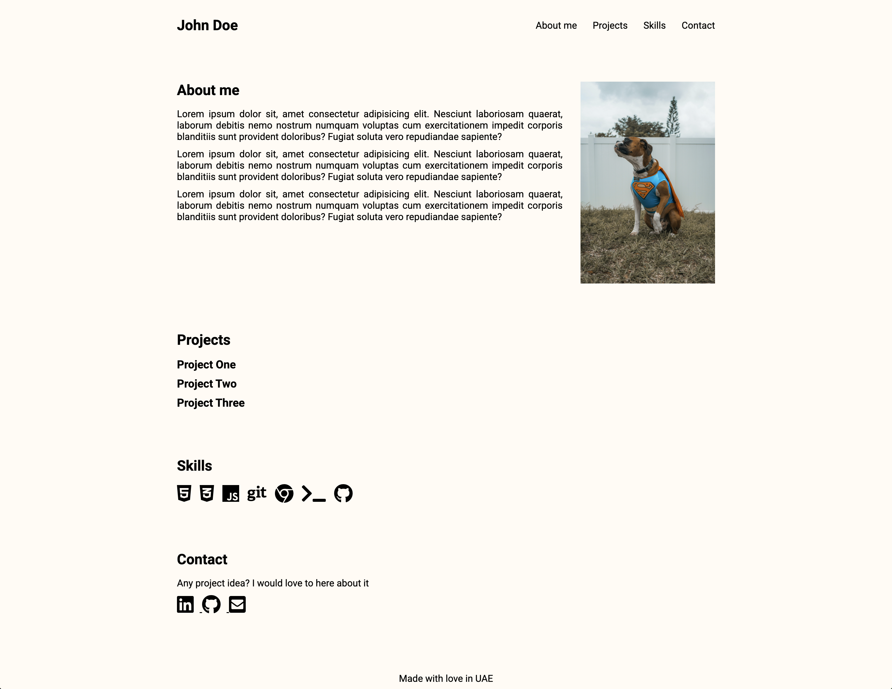

# Personal Portfolio Website

This is a simple and elegant personal portfolio website showcasing projects, skills, and contact information.

## Table of Contents

- [About](#about)
- [Live Demo](#live-demo)
- [Features](#features)
- [Technologies Used](#technologies-used)
- [Folder Structure](#folder-structure)
- [Demo](#demo)


## About

This project is a personal portfolio website designed to highlight your work, skills, and contact details. The layout is clean and responsive, making it accessible on different devices.

## Live Demo

Check out the live version of the portfolio [here](https://tehuanmelo.github.io/portfolio-project-personal-website/).

## Features

- **Responsive Design**: Adapts to various screen sizes.
- **Projects Section**: Showcases completed projects with toggling details.
- **Skills Section**: Highlights technical skills using icons.
- **Contact Section**: Links to LinkedIn, GitHub, and email.
- **Dynamic Interactivity**: JavaScript adds toggle functionality for project details.

## Technologies Used

- **HTML5**
- **CSS3**
- **JavaScript**
- **Font Awesome** (for icons)

## Folder Structure
```bash
project-root/
├── index.html        # Main HTML file
├── css/
│   └── styles.css    # CSS for styling
├── script/
│   └── script.js     # JavaScript for interactivity
├── assets/
│   ├── images/       # Placeholder for images
│   │   ├── persona.jpg
│   │   ├── project-one.jpg
│   │   ├── project-two.jpg
│   │   └── project-three.jpg
```

## Demo


